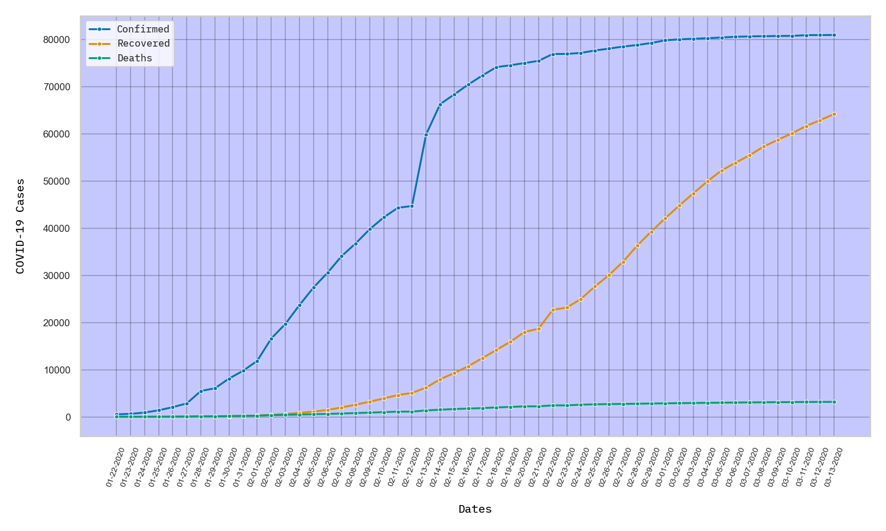

## Simple Flask COVID-19 Data Visualizer

Uses the data found here: https://github.com/CSSEGISandData/COVID-19 to produce graphs showing confirmed cases, recovered cases and deaths.

### Example Plot

## TODO

* Implement Mongo storage instead of CSV files
* Refactor etl_functions accordingly
* Switch from Seaborn to Bokeh
