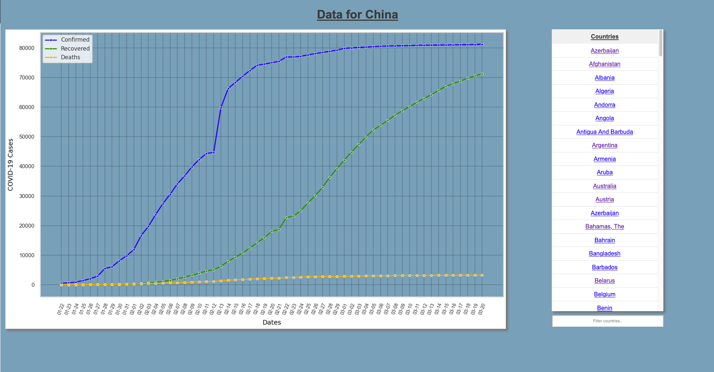

## Simple WIP Flask COVID-19 Data Visualizer

Uses the data found here: https://github.com/CSSEGISandData/COVID-19 to produce graphs showing confirmed cases, recovered cases and deaths.

### Example Page

## TODO

* Finish the switch from CSV files to Mongo
* Finish refactoring functions to classes
* Finished implementing proper logging
* Switch from Seaborn to Bokeh
